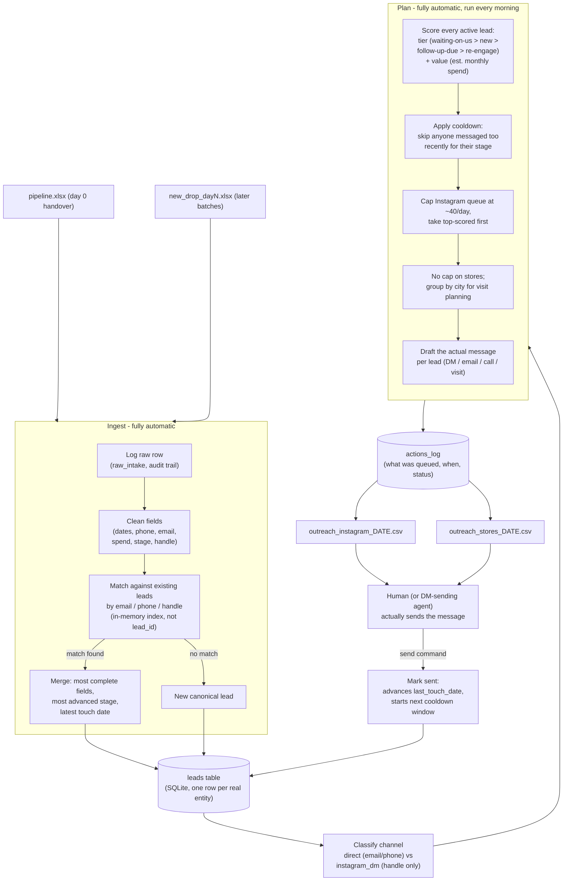

# Architecture

## How it fits together

## Where a person (or an agent) steps in, and where it's automatic

| Stage | Automatic | Needs a person / outbound agent |
|---|---|---|
| Cleaning, dedup, classification | Yes - runs on every ingest | |
| Deciding who gets today's 40 DMs | Yes - deterministic, re-derivable | |
| Drafting the message | Yes - template + lead data | A person should skim before sending; tone matters more than the bones |
| Actually sending the DM / email / making the call / visiting the shop | | Yes today. This is exactly where an Instagram-sending agent or an outbound email API would plug in next - the `send` command is already the seam for it |
| Reviewing flagged data-quality issues (malformed emails, etc.) | Flagged automatically (`data_quality_flags`) | A person resolves the actual contact detail |

The design goal is that everything **up to** "here's what to send and to
whom" runs unattended every morning. The only manual step left is pressing
send - which is also the step Instagram's own rate limit forces to be
paced and somewhat manual anyway.

## Why it holds up at 30,000 leads

- **Entity matching is O(1) per row**, not O(n). `ingest.py`'s `MatchIndex`
  builds an in-memory `email -> lead_key`, `phone_key -> lead_key`,
  `handle -> lead_key` dict once at the start of an ingest run, instead of
  running a `SELECT` against the (growing) `leads` table for every single
  incoming row. That's the difference between linear and quadratic ingest
  time, and it's the actual bottleneck this case study is testing for -
  `tests/scale_test.py` ingests 30,000 synthetic rows in ~9-10 seconds
  on a single core.
- **Writes are batched** (`executemany` + `INSERT ... ON CONFLICT`) instead
  of one `INSERT`/`UPDATE` per row.
- **Scoring is a single indexed query** (`stage NOT IN ('won','lost')`) plus
  a per-row pure-function score - no joins, no N+1 queries.
- **What would change next**, beyond 30k: swap SQLite for Postgres (same
  SQL, just a different connection string - nothing here is SQLite-specific
  syntax beyond `ON CONFLICT`, which Postgres also supports); move the
  Instagram-sending step itself behind a real queue so the ~40/day cap is
  enforced against actual platform send timestamps rather than a daily
  batch; and shard `plan` by assigned BDR / region if a single run starts
  taking too long for one morning.

## Why these specific design choices

- **Tier beats value, always.** The case study's own framing - "a lot of
  these leads are sitting half-replied with nobody following up" - is the
  signal that engagement state matters more than account size. A lead who
  replied yesterday should never lose their slot to a bigger but stone-cold
  new lead. `tests/test_scoring.py` pins this down explicitly.
- **Cooldowns differ by channel and stage**, not a single global number,
  because going quiet on Instagram (rate-limited, lower trust cost to
  re-attempt) is a different decision than going quiet on a store you've
  already called once.
- **The store sequence (email -> call -> visit) is driven by `num_touches`**,
  not a fixed calendar schedule, so a store that's already had two touches
  with no reply gets escalated straight to "go visit," and stores get
  grouped by city specifically so a week of visits can be planned as a
  single trip rather than one-off trips.
