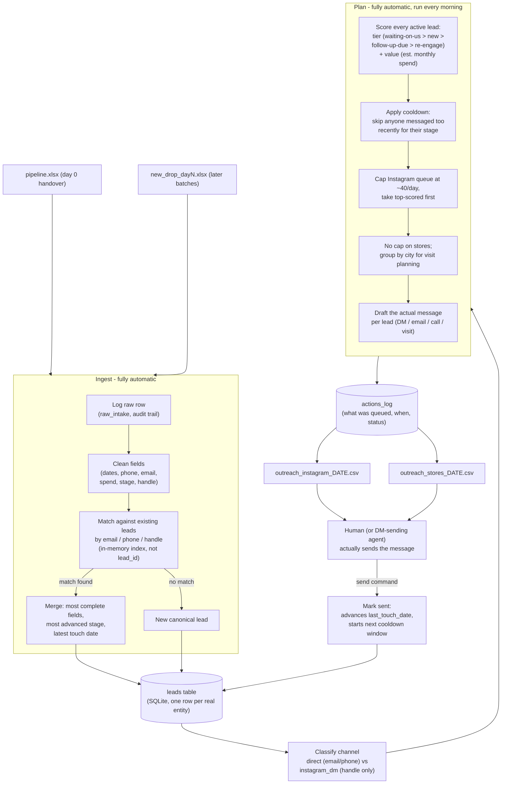

# Architecture

## How it fits together

## Where a person (or an agent) steps in, and where it's automatic

| Stage | Automatic | Needs a person / outbound agent |
|---|---|---|
| Cleaning, dedup, classification | Yes - runs on every ingest | |
| Deciding who gets today's 40 DMs | Yes - deterministic, re-derivable | |
| Drafting the message | Yes - template + lead data | A person should skim before sending; tone matters more than the bones |
| Actually sending the DM / email / making the call / visiting the shop | | Yes today. This is exactly where an Instagram-sending agent or an outbound email API would plug in next - the `send` command is already the seam for it |
| Reviewing flagged data-quality issues (malformed emails, etc.) | Flagged automatically (`data_quality_flags`) | A person resolves the actual contact detail |

The design goal is that everything **up to** "here's what to send and to
whom" runs unattended every morning. The only manual step left is pressing
send - which is also the step Instagram's own rate limit forces to be
paced and somewhat manual anyway.

## Why it holds up at 30,000 leads

- **Entity matching is O(1) per row**, not O(n). `ingest.py`'s `MatchIndex`
  builds an in-memory `email -> lead_key`, `phone_key -> lead_key`,
  `handle -> lead_key` dict once at the start of an ingest run, instead of
  running a `SELECT` against the (growing) `leads` table for every single
  incoming row. That's the difference between linear and quadratic ingest
  time, and it's the actual bottleneck this case study is testing for -
  `tests/scale_test.py` ingests 30,000 synthetic rows in ~9-10 seconds
  on a single core.
- **Writes are batched** (`executemany` + `INSERT ... ON CONFLICT`) instead
  of one `INSERT`/`UPDATE` per row.
- **Scoring is a single indexed query** (`stage NOT IN ('won','lost')`) plus
  a per-row pure-function score - no joins, no N+1 queries.
- **What would change next**, beyond 30k: swap SQLite for Postgres (same
  SQL, just a different connection string - nothing here is SQLite-specific
  syntax beyond `ON CONFLICT`, which Postgres also supports); move the
  Instagram-sending step itself behind a real queue so the ~40/day cap is
  enforced against actual platform send timestamps rather than a daily
  batch; and shard `plan` by assigned BDR / region if a single run starts
  taking too long for one morning.

## Honest limitations, and what's actually done about each

Three different kinds of "not perfect yet," sorted by what they actually need:

**Fixed in this build:**
- *Phone-matching collisions get more likely at scale, not less* (matching
  on last-9-digits to tolerate `+44`/`0044`/leading-zero formats). Fixed by
  flagging any merge where phone is the *only* matching field with no
  corroborating email or handle as `low_confidence_phone_merge`, rather than
  silently trusting it. `python -m src.cli review-queue` exports these.
- *The brief pictures this running every morning, agent-run - but there was
  no actual scheduling artifact, just a description of one.* Fixed with
  `run_daily.sh` (picks up any new file in `data/incoming/` via the new
  `auto-ingest` command, then plans the day) and
  `.github/workflows/daily_plan.yml`, which runs that script on a schedule
  on GitHub's infrastructure - no laptop has to be on for it to happen.
- *A handful of flagged rows (malformed emails, low-confidence merges) is
  trivial to eyeball at 265 rows, not at 30,000.* Fixed by making the flag
  an actual exportable, value-sorted worklist (`review-queue`) instead of
  an implicit "someone will notice."
- *Only Instagram had a daily cap; stores didn't.* Instagram's 40/day is a
  platform-enforced number, so it got a cap from day one. Stores don't have
  a platform rule, but a real team still can't send hundreds of emails and
  make dozens of calls in a day - without a cap, this produces a queue of
  thousands at 30k leads that nothing could ever work through. Fixed with
  separate `--email-cap` / `--call-cap` / `--visit-cap` (defaults 150/30/5),
  rather than one combined number - email can be automated and scales with
  sender deliverability, not headcount, while calls and visits are still
  genuinely human-time-limited; lumping them together either understated
  email's real ceiling or overstated what a human team can do on the other
  two. Same highest-score-first, capped-per-category mechanism as the
  Instagram cap, just split by what's actually scarce in each case.
- *A real bug found while testing the fix above, not before it*: marking an
  action `sent` updated `last_touch_date`/`num_touches` but never advanced
  a lead's stage from `new`. Since the `new` tier is deliberately
  cooldown-free (a never-contacted lead is always eligible), a lead that
  stayed labelled `new` forever would never leave that tier and would
  permanently win every day's queue, starving everything behind it. Caught
  by actually simulating two days of sends and checking whether the queue
  rotated (it didn't, at first) rather than trusting the cap alone to fix
  things - see `tests/test_send_rotation.py` for the regression test.

**Instrumented now, self-corrects once there's enough data:**
- *The scoring rubric started as a judgment call, not something trained on
  outcomes.* It's now built on the standard B2B lead-scoring structure
  (Fit + Engagement + funnel stage, the same three buckets most real lead
  scoring models use - see below), with weights chosen by reasoning, not
  guessed blind. But "reasoned" still isn't "proven." Every action already
  logs the score the lead had at the time (`actions_log.score`), and
  `python -m src.cli recalibrate` checks, every time it's run, whether
  there's enough real won/lost outcome data to responsibly fit actual
  weights with logistic regression - using the standard events-per-variable
  rule of thumb (~10 outcomes per feature in the smaller class). Today
  that's 9 won leads against a ~70-needed threshold for 7 features, so it
  correctly refuses to fit anything and says so explicitly. It never
  silently rewrites `scoring.py` even once there's enough data - it writes
  a recommendation file for a human to review. (Verified this actually
  works, not just looks plausible: ran it against a synthetic batch where
  spend and "having replied" were deliberately made to predict winning, and
  it correctly recovered strong positive coefficients on exactly those two
  features - see git history for the test run.)
- *Run `python -m src.cli calibration`* for a lighter, no-dependency check
  in the meantime: average score of leads that have actually won vs lost
  *through the tool's own loop*. Correctly reports no data yet on a fresh
  handover, since already-resolved leads predate the tool.

**Known limitation, not worth building yet:**
- *One Instagram sending account means the 40/day cap doesn't scale to
  30,000 leads* - getting through the backlog would take years at that
  rate. The real fix (multiple warmed accounts, each with its own cap and
  cooldown pool) is an ops decision about Fleek's actual Instagram
  presence, not a code problem - building multi-account support now would
  be solving a problem that doesn't exist yet.
- *SQLite has a single-writer lock* - fine for one daily `plan` run; would
  matter if multiple reps/processes wrote concurrently. The schema uses
  standard SQL (`ON CONFLICT` aside, which Postgres also supports), so this
  is a connection-string swap when it's actually needed, not a rewrite.

## Why these specific design choices

- **The scoring structure follows how real B2B lead scoring is built, not
  an invented rubric.** Most production lead-scoring models split into
  Fit (does this account look like a real, sizable business - here:
  spend, sales velocity, listings, followers), Engagement (are they
  actually interacting with us - here: replies, touch count, recency), and
  funnel stage/status, which independent research found to be one of the
  *strongest* individual predictors of conversion on its own. That's why
  stage is the primary gate (the tier system) here, with Fit+Engagement
  only breaking ties within a tier - it mirrors that finding rather than
  treating spend and stage as equally-weighted inputs into one number.
- **Tier beats value, always.** The case study's own framing - "a lot of
  these leads are sitting half-replied with nobody following up" - is the
  signal that engagement state matters more than account size. A lead who
  replied yesterday should never lose their slot to a bigger but stone-cold
  new lead. `tests/test_scoring.py` pins this down explicitly.
- **Cooldowns differ by channel and stage**, not a single global number,
  because going quiet on Instagram (rate-limited, lower trust cost to
  re-attempt) is a different decision than going quiet on a store you've
  already called once.
- **The store sequence (email -> call -> visit) is driven by `num_touches`**,
  not a fixed calendar schedule, so a store that's already had two touches
  with no reply gets escalated straight to "go visit," and stores get
  grouped by city specifically so a week of visits can be planned as a
  single trip rather than one-off trips.
